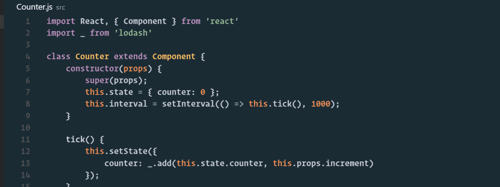

# React Hot Loader 3.0 Boilerplate for Visual Studio Code

A react boilerplate project for Visual Studio Code based on [react-transform-boilerplate](https://github.com/gaearon/react-transform-boilerplate) and [React Hot Loader 3.0](https://github.com/gaearon/react-hot-boilerplate/pull/61)
***

## Features
* Intellisense (code completion) for external libraries via [Automatic Type Acquisition (ATA)](https://code.visualstudio.com/updates/v1_7) 
* Debugging react ES2015 classes inside vscode via [vscode-chrome-debug](https://github.com/Microsoft/vscode-chrome-debug) extension
* Easy access to install, build and debugging commands via vscode command palette and keyboard shortcuts
* JSX code analysis (linting) with autofixing support via [vscode-eslint](https://github.com/Microsoft/vscode-eslint) extension
* [React Hot Loading](https://www.youtube.com/watch?v=xsSnOQynTHs)

## Visual Studio Code

* [**Download**](https://code.visualstudio.com/)
* [**Tips and Tricks**](https://github.com/Microsoft/vscode-tips-and-tricks)

### Required Extensions

* [**vscode-chrome-debug**](https://marketplace.visualstudio.com/items?itemName=msjsdiag.debugger-for-chrome)
* [**vscode-eslint**](https://marketplace.visualstudio.com/items?itemName=dbaeumer.vscode-eslint)

### Recommended Extensions

* [ReactSnippets](https://marketplace.visualstudio.com/items?itemName=xabikos.ReactSnippets)
* [vscode-npm](https://marketplace.visualstudio.com/items?itemName=fknop.vscode-npm)
* [npm-intellisense](https://marketplace.visualstudio.com/items?itemName=christian-kohler.npm-intellisense)

## Installation

1.   `git clone https://github.com/skolmer/react-hot-boilerplate-vscode.git`
2.   open react-hot-boilerplate-vscode in Visual Studio Code
3.   make sure you have [vscode-chrome-debug](https://marketplace.visualstudio.com/items?itemName=msjsdiag.debugger-for-chrome) and [vscode-eslint](https://marketplace.visualstudio.com/items?itemName=dbaeumer.vscode-eslint) extension installed
4.   press <kbd>F1</kbd> > `Run Task` > `install` (or `npm install`) to install all dependencies

## Visual Studio Code shortcuts

*   <kbd>F5</kbd> to start debugging
*   <kbd>CTRL</kbd>+<kbd>SHIFT</kbd>+<kbd>B</kbd> to build a production release
*   <kbd>CTRL</kbd>+<kbd>SHIFT</kbd>+<kbd>T</kbd> to run eslint

## License

CC0 (public domain)
